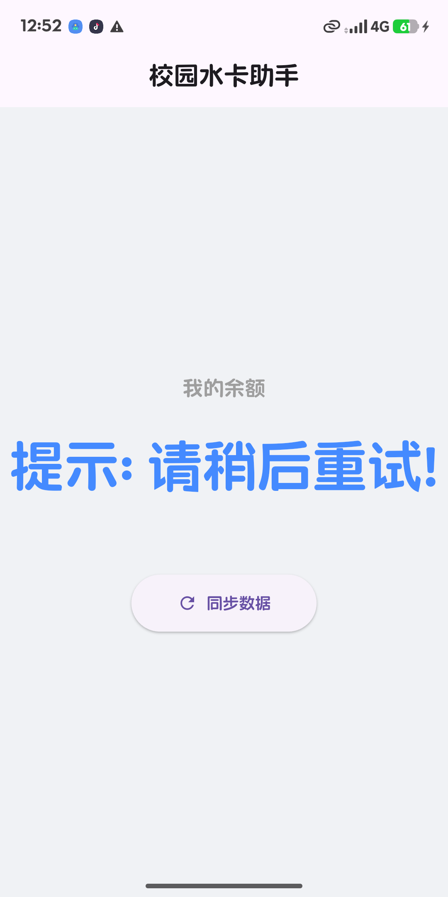

# UY Water

一个基于 Flutter 的校园用水控制客户端，面向常用设备管理、开关水控制、历史账单查看和 iOS 实时活动使用场景。

> 本项目为个人学习与自用项目，并非官方应用。请仅在你拥有合法账号和设备使用权限的前提下使用。

## 功能特性

- 手机号验证码登录，登录状态本地持久化。
- 常用设备管理，支持绑定、重命名、删除、排序和默认设备设置。
- 开水 / 关水控制，展示余额、当前设备和运行状态。
- 历史账单按年月查询，支持本地用水时长补丁合并。
- Hive 持久化本地用水记录，避免 App 重启后时长丢失。
- 设备卡片统计，展示设备历史使用次数和月度使用概览。
- 深色智能家居风格首页、登录页和弹窗 UI。
- iOS Live Activity / Dynamic Island，用水中显示计时，关水后显示结算信息。
- iOS App Intents / Shortcuts，支持通过快捷指令使用默认设备开关水。
- 设备二维码扫描，辅助快速绑定设备。

## 技术栈

- Flutter / Dart
- Provider 状态管理
- Hive / shared_preferences 本地存储
- http / http2 / crypto 网络请求与签名
- mobile_scanner 二维码扫描
- image_picker / image_cropper 图片选择与裁剪
- iOS ActivityKit / WidgetKit / AppIntents / SwiftUI

## 项目结构

```text
lib/
  core/                 全局 key、toast 等基础能力
  models/               用水记录等数据模型
  providers/            用户、设备、用水状态管理
  services/             API、实时活动、快捷指令上下文服务
  ui/
    pages/              登录页、首页、二维码扫描页
    widgets/            设备卡片、历史账单、弹窗等 UI 组件

ios/
  Runner/               Flutter iOS 主 App
  Live Activities/      实时活动、Dynamic Island、AppIntent 原生能力

.github/workflows/
  ios_unsigned_build.yml  GitHub Actions 无签名 iOS 构建
```

## 本地运行

确保已安装 Flutter，并完成对应平台的开发环境配置。

```bash
flutter pub get
flutter run
```

iOS 运行前通常需要安装 CocoaPods 依赖：

```bash
cd ios
pod install
cd ..
flutter run
```

## 构建

Android:

```bash
flutter build apk --release
```

iOS:

```bash
flutter build ios --release
```

仓库内包含 GitHub Actions 工作流，可在 `main` 分支推送或手动触发后生成无签名 iOS IPA 构建产物。

## iOS 实时活动说明

实时活动用于展示当前用水状态：

- 开水后显示 `用水中`、设备名和计时。
- 展开 Dynamic Island 后可直接点击 `结束` 关水。
- 关水后显示 `已关水`、用水时长和扣费金额。

交互式按钮依赖 iOS 17+ 的 App Intents；Live Activity 本身依赖 iOS 16.1+。如果需要完整使用快捷指令和灵动岛交互，请使用支持 Dynamic Island / Live Activities 的 iPhone 和对应系统版本。

## 数据与隐私

本项目会在本地保存登录态、设备列表、默认设备、历史账单缓存和用水时长补丁等数据。请不要提交个人 token、手机号、抓包文件、真实账号信息或其他敏感数据到公开仓库。

## 注意事项

- 项目接口依赖第三方服务，服务规则、签名参数和返回字段可能发生变化。
- 历史账单与本地时长通过订单号、设备信息和时间进行合并，极端情况下需要重新同步账单。
- 无签名 iOS 构建不等同于可直接安装的正式包，真机安装仍需要合适的签名方式。

## 截图

如果需要在 GitHub 首页展示界面，可以将截图放在仓库根目录或 `docs/images/` 下，并在这里引用：

```markdown

```

## License

当前仓库未指定开源许可证。未经作者许可，请勿用于商业用途或再分发。
